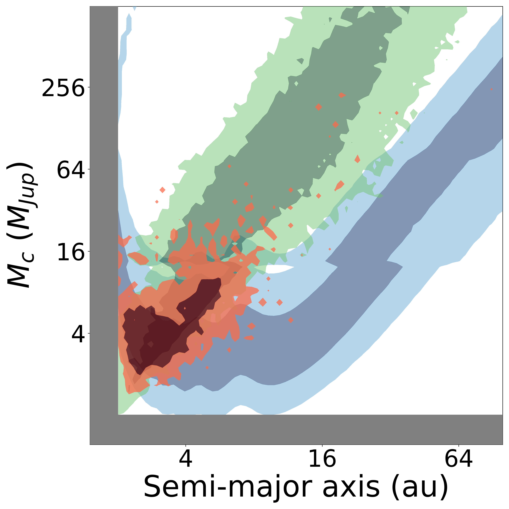
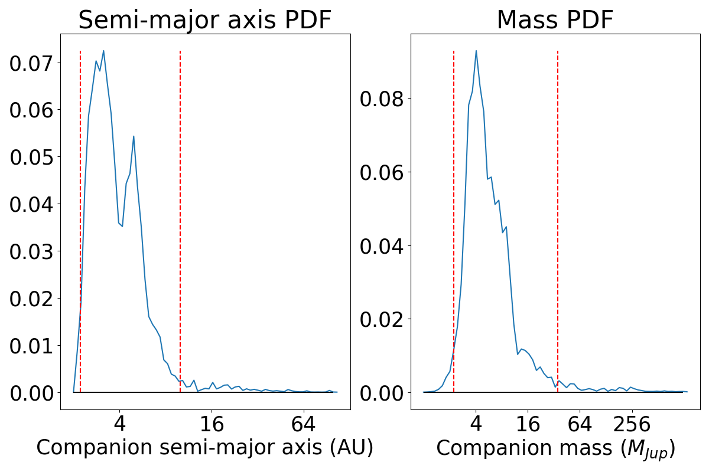
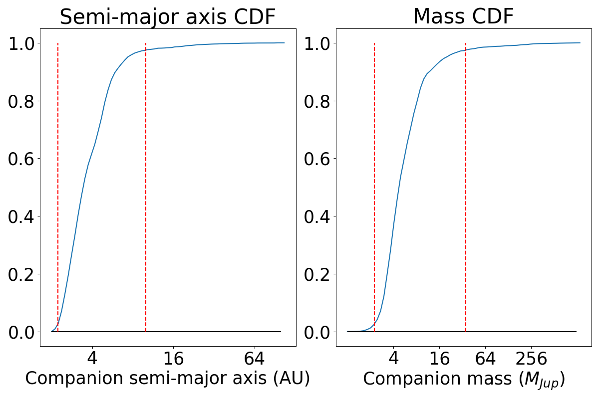

# Ethraid

Characterize long-period companions with partial orbits.

Please cite Van Zandt \& Petigura (2024, Accepted) and the following DOI if you make use of this software in your research.
[](https://zenodo.org/doi/10.5281/zenodo.10841606)

## Environment
### Create new environment with python 3.7
- *\$ conda create --name ethraid_env python=3.7*
- *\$ conda activate ethraid_env*

## Download using pip
- *\$ pip install ethraid*
- If the installation fails, try upgrading pip: *\$ curl https://bootstrap.pypa.io/get-pip.py | python*

## Download repo from Github
### Install dependencies using requirements.txt 
- *\$ pip install -r requirements.txt*

### Build code from top level of repo
- *\$ cd trends/*
- *\$ python setup.py build_ext --inplace*

### Run 3 simple test configuration files to ensure all API and CLI functions are working correctly
- *\$ python test.py*
    - This should only take a few minutes. Desired outcome:
        ```
        Test complete:
            0 errors encountered running API array calculation
            0 errors encountered running API array loading
    	    0 errors encountered running CLI array calculation
            0 errors encountered running CLI array loading
            0 errors encountered running CLI 'all' function
        ```
    - These are only meant to test basic functionality. The output plots and bounds will be meaningless because of the small number of models sampled.

## Create a configuration file from the template provided and provide the required parameters and desired data
- *\$ cp template_config.py my_config.py*
- NOTE: ethraid uses AU for all distances and M_Jup for all masses. Access helpful conversion factors using e.g.

    ```
    from ethraid import Ms2Mj, pc_in_au
    ```
    which respectively convert solar masses to Jupiter masses and parsecs to AU in your config file.

## Example usage
### CLI: Run orbit fits, plot results, and print 95\% confidence intervals all at once from the command line. Ethraid's installation includes a configuration file, ```example/config_191939.py```, which may be used to validate its functionality on the system HD 191939.
- *\$ ethraid all -cf path/to/ethraid/example/config_191939.py* -rfp results/191939/191939_processed.h5 -t 1d 2d
    - Note that the *-rfp* (read file path) flag requires the path to the output directory where the fit results are stored. On a first run, this path *does not exist yet,* but it will be created after the fit and before plotting.

### Alternative: run each command separately

#### Run orbit fits using parameters in configuration file
- *\$ ethraid run -cf path/to/ethraid/example/config_191939.py*
#### Load and plot saved results
- *\$ ethraid plot -cf path/to/ethraid/example/config_191939.py -rfp results/191939/191939_processed.h5 -t 1d 2d*
#### Print 95\% mass and semi-major axis confidence intervals based on derived posterior
- *\$ ethraid lims -cf path/to/ethraid/example/config_191939.py -rfp results/191939/191939_processed.h5*

### Another alternative: use the api_run.py module to interface easily with the API

- Add the following code to the end of the module to run a fit, plot the results, and print a summary to the command line.

    ```
    if __name__ == "__main__":
    
        config_path = 'path/to/ethraid/example/config_191939.py'
        read_file_path = 'results/191939/191939_processed.h5'
    
    
        plot=True
        verbose = True
    
        run(config_path, read_file_path,
            plot=plot, verbose=verbose)
    ```

## Results
#### Running ethraid from scratch will generate a directory called *results/\{star_name\}/* containing the raw (large, reshapeable) posterior arrays and/or their processed (small, non-reshapeable) counterparts. After plotting, the directory will contain up to three plots: a joint 2D posterior in mass-separation space, as well as the marginalized 1D PDFs and CDFs. Samples of these plots are below.

- 2D joint posterior  
    

- 1D PDFs  
    

- 1D CDFs  
    


## Troubleshooting

### Why are my posteriors splotchy?
- Try increasing the *num_points* argument. This will increase the number of sampled orbit models with a corresponding rise in run time.
- Try decreasing the *grid_num* argument. This will lower the resolution of the grid and help smooth over stochastic variation with no increase in run time.

### Why does my RV/astrometry posterior extend down to the low-mass/high-separation regime (the bottom-right corner)? It's not helping to rule out any models!
- Check your input data values. They may be consistent with 0, meaning that companions producing negligible signals are good fits to the data.

### Why does the astrometry posterior have large overlap with the RVs? It's not helping to rule out any models!
- Check the range of orbital separations you're probing. Beyond ~25 years (~8.5 AU for a Sun-like star), the RV and astrometry posteriors have the same m-a relation, and thus have the same information content.

### How do I check the &Delta;&mu; value of my desired target in the *Hipparcos-Gaia* Catalog of Accelerations?

- Use the built-in API function:

    ```
    from ethraid.compiled import helper_functions_astro as help_astro
    
    help_astro.HGCA_retrieval(hip_id="99175")
    ```

    Output:

    ```
    (0.12684636376342961, 0.03385628059095324)
    ```
    
    This target has &Delta;&mu; = 0.127 +/- 0.034 mas/yr, a 3.7 &sigma; measurement.
